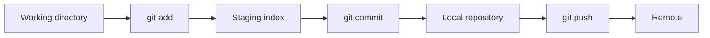

# Demo Git — hướng dẫn nhanh

Git là hệ thống **quản lý phiên bản phân tán**: mỗi máy có bản sao lịch sử đầy đủ, làm việc offline được, và hợp tác qua remote (GitHub, GitLab, …).

## Luồng cơ bản



- **Working directory**: file bạn đang sửa trên đĩa.
- **Staging**: vùng “chuẩn bị” commit — chỉ những thay đổi đã `git add` mới vào commit tiếp theo.
- **Commit**: một snapshot có message, trỏ về commit trước (chuỗi lịch sử).

## Lệnh thường dùng (demo)

| Mục đích | Lệnh |
|----------|------|
| Khởi tạo repo trong thư mục hiện tại | `git init` |
| Sao chép repo có sẵn | `git clone <url>` |
| Xem trạng thái | `git status` |
| Đưa file vào staging | `git add <file>` hoặc `git add .` |
| Tạo commit | `git commit -m "Mô tả ngắn"` |
| Xem lịch sử | `git log --oneline` |
| Tạo và chuyển nhánh | `git switch -c ten-nhanh` |
| Gộp nhánh vào nhánh hiện tại | `git merge ten-nhanh` |
| Liên kết remote | `git remote add origin <url>` |
| Lấy thay đổi từ remote | `git pull` |
| Đẩy commit lên remote | `git push -u origin main` |

## Kịch bản demo ngắn (local)

```bash
mkdir demo-git && cd demo-git
git init
echo "# Demo" > README.md
git add README.md
git commit -m "Initial commit: README"
git switch -c feature/chao-hoi
echo "Xin chào Git!" >> README.md
git add README.md
git commit -m "Thêm lời chào"
git switch main
git merge feature/chao-hoi
```

## Ghi chú khi làm việc theo nhóm

1. **Pull trước, push sau** — giảm xung đột.
2. **Commit nhỏ, message rõ** — dễ review và revert.
3. **Nhánh tính năng** — `main`/`develop` ổn định, làm việc trên `feature/...`.
4. **`.gitignore`** — không commit secret, `node_modules`, file build, …

## Tài liệu tham khảo

- [Git Book (tiếng Anh)](https://git-scm.com/book/en/v2)
- `git help <lệnh>` — ví dụ `git help commit`

---

*Tài liệu demo — có thể chỉnh sửa theo buổi training thực tế.*
